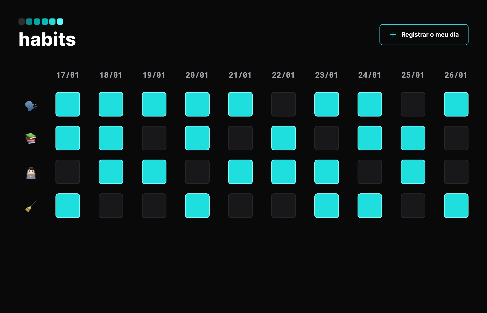

<h1 align="center">Habits</h1>

O NLW foi um evento gratuito feito pela Rocketseat com intuito de apresentar as principais ferramentas usadas para a criação de um site.

<a href="#-tecnologias">Tecnologias</a>&nbsp;&nbsp;&nbsp; | &nbsp;&nbsp;&nbsp;
<a href="#-projeto">Projeto</a>&nbsp;&nbsp;&nbsp; | &nbsp;&nbsp;&nbsp;
<a href="#-layout">Layout</a>&nbsp;&nbsp;&nbsp;

 

 

## 💻 Projeto

O projeto Habits teve o intuito de ajudar o usuario a ter uma visão geral dos habitos cocnluidos e não concluidos

 

 

## 👾 Tecnologias

Esse projeto foi desenvolvido com as seguintes tecnologias:

- HTML e CSS
- JavaScript
- Git e Github

 

 

## 🔖 Layout
 

    

